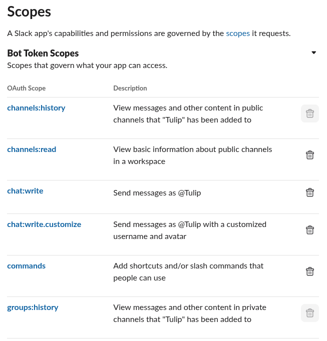

# HowSlackFeels
A HowWeFeel-like Slack bot

# Running

1. Create a Slack app, enable socket mode and oauth, set the following scopes:



2. Clone the project
3. Add this to `.env`:

```env
SLACK_APP_TOKEN=xapp-token
SLACK_BOT_TOKEN=xoxb-token
```

4. Run `npm i`
5. Run `npm start` to start the bot.